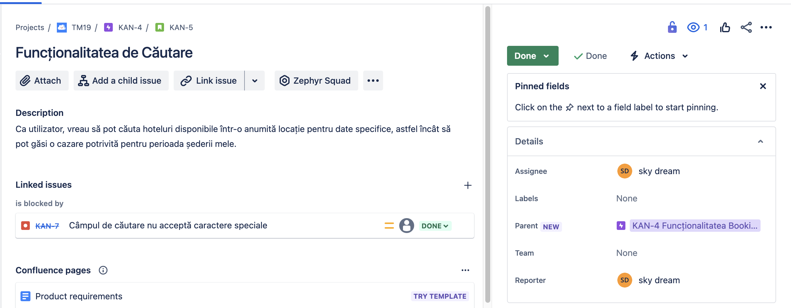
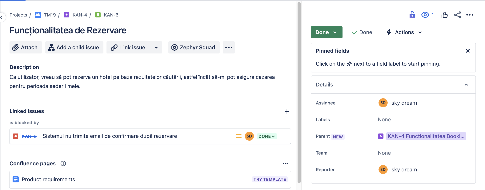
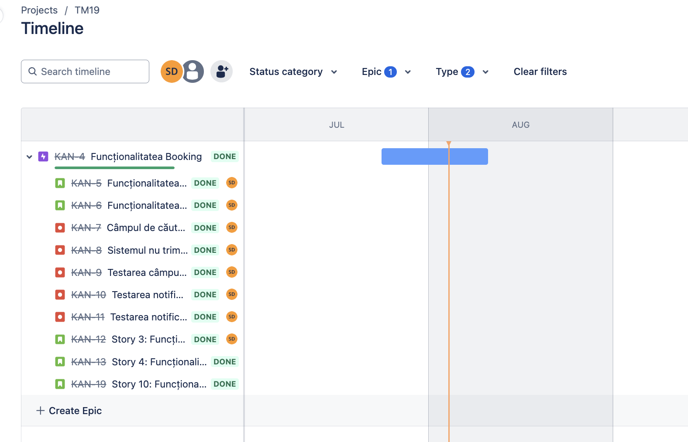
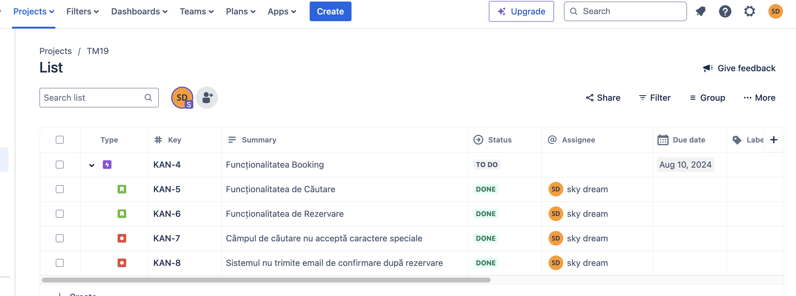
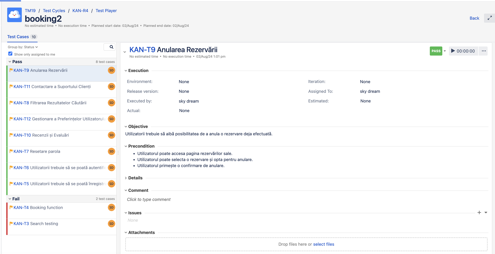
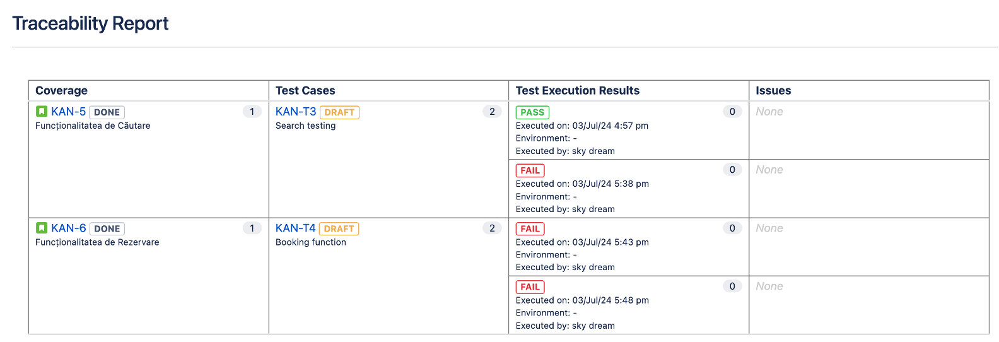

<h1>Testing Project for Booking.com </h1>

The scope of the final project for ITF Manual Testing Course is to use all gained knowledge throught the course and apply them in practice, using a live application

Application under test: **booking.com**

Tools used: Jira, Zephyr Squad.

<h2>Functional specifications:</h2>

The below stories was created in Jira and describes the functional specifications of the "**Funcționalitatea Booking**" module, for which the final project is performed upon.

Here you can find the release that was created for this project:

<h2>Testing process</h2>

The test process was performed based on the standard test process as described below.

<h3>1.1 Test planning</h3>

The Test Plan is designed to describe all details of testing for all the modules from the Booking application.

The plan identifies the items to be tested, the features to be tested, the types of testing to be performed, the personnel responsible for testing, the resources and schedule required to complete testing, and the risks associated with the plan. The test plan that was created for this project can be found here [Test Plan for Booking](doc/Test Plan for Booking.docx)

<h4>1.1.1. Roles asigned to the project and persons allocated</h4>

<ul>
  <li>Project manager: Andreea Ion</li>
  <li>Product owner: Mircea Miron</li>
  <li>Software developer: Corina Danila </li>
  <li>QA Engineer: Daniela Roman</li>
</ul>

<h4> 1.1.2 Entry criteria defined </h4>

- Definirea și aprobarea cerințelor de business
- Crearea și aprobarea planului de testare
- Asigurarea disponibilității mediului de testare (Windows, macOS, Android)
- Instalarea și configurarea browserului Google Chrome versiunea 83.0 sau mai nou
- Specificațiile tehnice pentru laptopuri: procesor Intel Core i5 de generația a 8-a, RAM 8 GB, stocare 256 GB SSD, rezoluție ecran Full HD (1920 x 1080)
- Asigurarea accesului la Jira și Zephyr Squad
- Prezența echipei de testare

<h4> 1.1.3 Exit criteria defined </h4>

- Toate testele planificate au fost executate
- Toate defectele critice și majore au fost remediate și retestate
- Matricea de trasabilitate a fost completată și verificată
- Raportul de testare final a fost generat și revizuit
- Aproximativ 95% din cerințele de business au fost acoperite de teste
- Testele de regresie au fost efectuate și nu au apărut noi defecte majore

<h4> 1.1.4 Test scope</h4>

<h5> Tests in scope: </h5>

- Testarea funcționalității câmpului de căutare
- Testarea funcționalității butonului de căutare
- Testarea afișării rezultatelor căutării pentru diferite locații și perioade
- Testarea formularului de rezervare
- Testarea procesării rezervării
- Testarea afișării mesajelor de confirmare sau eroare
- Tehnici de testare: testare funcțională, testare de regresie, testare de performanță
- Dispozitive: laptopuri cu Windows 10, macOS Catalina, dispozitive Android 9.0

<h5>Tests not in scope: </h5>

- Testarea aplicației pe dispozitive iOS
- Testarea compatibilității cu browsere mai vechi decât Google Chrome versiunea 83.0
- Testarea accesibilității pentru utilizatori cu dizabilități (de exemplu, testarea cu screen readers)
- Testarea localizării pentru alte limbi decât engleză

<h4>1.1.5 Risks detected</h4>

<h5>Project risks:</h5>

- Întârzieri în livrarea mediului de testare
- Disponibilitatea echipei de testare limitată
- Defecte descoperite târziu în ciclul de testare
- Lipsa documentației detaliate pentru unele funcționalități

<h5> Product risks: </h5>

- Defect mediu: sistemul nu procesează text cu caractere speciale
    - Pierderea clienților
    - Imagine de brand scăzută
    - Frustrarea clienților
    - Reducerea accesibilității
    - Impact asupra suportului tehnic
    - Pierderi financiare
    - Probleme legale

- Defect mare: sistemul nu trimite email de confirmare după rezervare
    - Pierderea clienților
    - Imagine de brand scăzută
    - Frustrarea clienților
    - Impact asupra suportului tehnic
    - Impact operațional
    - Probleme de logistică
    - Pierderi financiare
    - Risc reputațional
    - Incongruențe în sistem

<h4>1.1.6 Evaluating entry criteria</h4>

The entry criteria defined in the Test Planning phase have been achieved and the test process can continue.

<h3>1.2 Test Monitoring and Control</h3>

Etapa de monitorizare și control a fost realizată pentru a asigura că procesul de testare se desfășoară conform planului stabilit și că toate activitățile de testare sunt urmărite și gestionate eficient. Aceasta etapă este esențială pentru a identifica devierile față de planul inițial, pentru a evalua progresul testării și pentru a lua decizii informate referitoare la eventualele ajustări necesare. Monitorizarea și controlul contribuie la asigurarea calității produsului final și la identificarea timpurie a problemelor care pot afecta lansarea acestuia.

Cum s-a realizat monitorizarea și controlul
Monitorizarea și controlul au fost efectuate prin următoarele activități:

Urmărirea progresului testării: Progresul a fost monitorizat zilnic prin verificarea stării testelor și a numărului de teste executate, reușite și eșuate.
Raportarea stării testelor: S-au generat rapoarte periodice de status pentru a reflecta activitatea și evoluția testării.
Revizuirea bug-urilor: Toate bug-urile raportate au fost revizuite și gestionate pentru a asigura corectarea lor înainte de lansarea produsului.
Întâlniri de status: S-au organizat întâlniri periodice cu echipa de testare și părțile interesate pentru a discuta progresul, problemele întâmpinate și planurile de acțiune.

<h3> 1.3 Test Analysis </h3>
The testing process will be executed based on the application requirements. 

The following test conditions were found:  

- Verificarea existenței câmpului de căutare
- Verificarea funcționalității butonului de căutare
- Verificarea afișării rezultatelor căutării
- Verificarea funcționalității formularului de rezervare
- Verificarea completării datelor necesare în formularul de rezervare
- Verificarea procesării rezervării
- Verificarea afișării mesajelor de confirmare
- Verificarea afișării mesajelor de eroare
- Verificarea procesării textului cu caractere speciale
- Verificarea trimiterii email-urilor de confirmare

<h3>1.4 Test Design</h3>

Functional test cases were created in Zephyr Squad based on the analysis of the specifications. The test cases can be accessed here 
- [Story 1: Funcționalitatea de Căutare](doc/KAN-5.doc)
- [Story 2: Funcționalitatea de Rezervare](doc/KAN-6.doc)
- [Bug1: Câmpul de căutare nu acceptă caractere speciale](doc/KAN-7.doc)
- [Bug2: Sistemul nu trimite email de confirmare după rezervare](doc/KAN-8.doc)

<h3>1.5 Test Implementation</h3>

The following elements are needed to be ready before the test execution phase begins:

- Toate cerințele de business și funcționale definite și aprobate
- Mediul de testare configurat și accesibil
- Acces la Jira și Zephyr Squad pentru echipa de testare
- Crearea și asignarea testelor în Zephyr Squad
- Disponibilitatea echipei de testare

<h3>1.6. Test Execution </h3>

Test cases are executed on the created test Cycle summary: 

Bugs have been created based on the failed tests. The complete bug reports can be found here.

The following is a summary of the bugs that have been found

[Bug1: Câmpul de căutare nu acceptă caractere speciale](doc/KAN-7.doc)

[Bug2: Sistemul nu trimite email de confirmare după rezervare](doc/KAN-8.doc)

- Bug 1: Sistemul nu procesează text cu caractere speciale
  - Prioritate: Medie
  - Severitate: Medie

- Bug 2: Sistemul nu trimite email de confirmare după rezervare
  - Prioritate: Mare
  - Severitate: Mare

Full regression testing is needed on the impacted areas after the bugs are fixed and retesting will be done for every functionality that was previously failed.

1.7 Test Completion
As the Exit criteria were met and satisfied as mentioned in the appropriate section, this feature is suggested to ‘Go Live’ by the Testing team

The traceability matrix was generated and can be found here: 

Test execution chart was generated and can be found below. 

The final report shows that a number 2 tests have failed of a total of 2.

A number of 2 total bugs were found, from which the priority is: 1 are high and 1 are medium.

În urma testării, au fost create și executate 2 teste. Aproximativ 89% din cerințele incluse în scop au fost acoperite. Există anumite funcționalități care nu au fost testate din cauza constrângerilor de timp și resurse, cum ar fi testarea pe dispozitive iOS și compatibilitatea cu browsere mai vechi. Bug-urile identificate nu impactează în mod semnificativ lansarea produsului în producție și pot fi remediate ulterior. Recomandăm lansarea produsului cu monitorizare atentă și corectarea rapidă a defectelor critice post-lansare. Riscurile de produs identificate ar trebui mitigate în următoarele iterații de dezvoltare. Lessons learned includ importanța unui plan de testare detaliat și necesitatea unei testări continue și a unei comunicări eficiente în echipă.