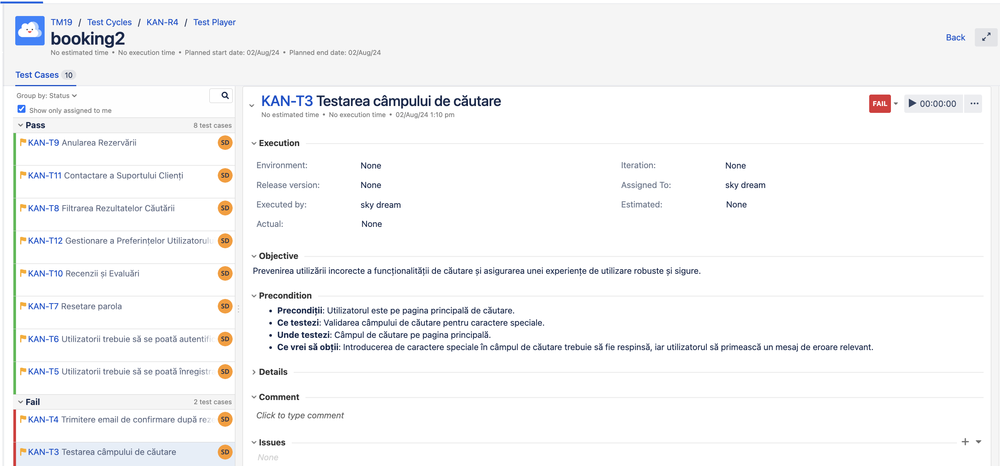
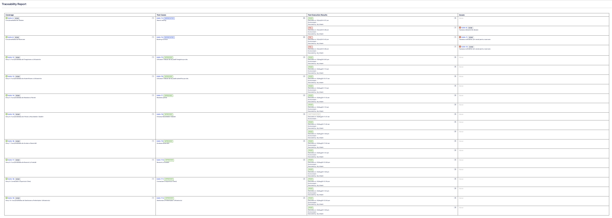

<h1>Testing Project for Booking.com </h1>

The scope of the final project for ITF Manual Testing Course is to use all gained knowledge through the course and apply them in practice, using a live application

Application under test: **booking.com**

Tools used: Jira, Zephyr Squad.

<h2>Functional specifications:</h2>

The below stories was created in Jira and describes the functional specifications of the "**Funcționalitatea Booking**" module, for which the final project is performed upon.

Here you can find the release that was created for this project:

<h2>Testing process</h2>

The test process was performed based on the standard test process as described below.

<h3>1.1 Test planning</h3>

The Test Plan is designed to describe all details of testing for all the modules from the Booking application.

The plan identifies the items to be tested, the features to be tested, the types of testing to be performed, the personnel responsible for testing, the resources and schedule required to complete testing, and the risks associated with the plan. The test plan that was created for this project can be found here [Test Plan for Booking](doc/test_plan_booking.pdf)

<h4>1.1.1. Roles asigned to the project and persons allocated</h4>

<ul>
  <li>Project manager: Andreea Ion</li>
  <li>Product owner: Mircea Miron</li>
  <li>Software developer: Corina Danila </li>
  <li>QA Engineer: Daniela Roman</li>
</ul>

<h4> 1.1.2 Entry criteria defined </h4>

- Definition and approval of business requirements
- Creation and approval of the test plan
- Ensuring the availability of the testing environment (Windows, macOS, Android)
- Installation and configuration of Google Chrome browser version 83.0 or newer
- Technical specifications for laptops: 8th generation Intel Core i5 processor, 8 GB RAM, 256 GB SSD storage, Full HD screen resolution (1920 x 1080)
- Ensuring access to Jira and Zephyr Squad
- Presence of the testing team

<h4> 1.1.3 Exit criteria defined </h4>

- All planned tests have been executed
- All critical and major defects have been fixed and retested
- The traceability matrix has been completed and verified
- The final test report has been generated and reviewed
- Approximately 95% of the business requirements have been covered by tests
- Regression tests have been performed, and no new major defects have been identified

<h4> 1.1.4 Test scope</h4>

<h5> Tests in scope: </h5>

- Testing the search field functionality
- Testing the search button functionality
- Testing the display of search results for different locations and dates
- Testing the booking form functionality
- Testing the booking processing
- Testing the display of confirmation or error messages
- Testing techniques: functional testing, regression testing, performance testing
- Devices: laptops with Windows 10, macOS Catalina, Android 9.0 devices

<h5>Tests not in scope: </h5>

- Testing the application on iOS devices
- Testing compatibility with browsers older than Google Chrome version 83.0
- Testing accessibility for users with disabilities (e.g., testing with screen readers)
- Testing localization for languages other than English

<h4>1.1.5 Risks detected</h4>

<h5>Project risks:</h5>

Project Risks:
 Testing Environment Delivery Delays
- Consequence:
    - Project Delays: Delay in the delivery of the testing environment can push back the entire testing schedule, causing a domino effect that delays subsequent phases of the project.
    - Increased Costs: Extended project timelines can lead to increased labor and operational costs.
    - Development Pressure: Development teams might face pressure to accelerate their work to make up for lost time, which can lead to rushed and lower-quality outputs.

 Limited Availability of the Testing Team
- Consequence:
  - Incomplete Testing: Limited availability may result in not all test cases being executed, increasing the risk of undetected defects.
  -  Rushed Testing: The testing that does occur may be rushed, leading to inadequate test coverage.
  - Overlooked Defects: Critical defects may go unnoticed, leading to potential issues post-release.
  

Defects Discovered Late in the Testing Cycle

- Consequence:
    - High Fix Costs: Fixing defects late in the cycle is typically more costly in terms of both time and resources compared to addressing them earlier.
    - Release Delays: Late discoveries can push back release dates, affecting go-to-market strategies.
    - Reduced Quality: The overall quality of the product may suffer if fixes are rushed to meet deadlines.

Lack of Detailed Documentation for Some Functionalities
- Consequence:
    - Implementation Errors: Lack of clear documentation can lead to misunderstandings about functionality requirements, resulting in implementation errors.
    - Onboarding Challenges: New team members may find it difficult to get up to speed, reducing productivity.
    - Increased Defects: Without detailed documentation, the likelihood of defects increases due to unclear or misunderstood requirements.

Product Risks:
- Medium Defect: System Does Not Process Text with Special Characters 

 - Consequence:
    - Loss of Customers: Users who input special characters and experience errors may abandon the platform.
    - Decreased Brand Image: Frequent issues with character processing can damage the platform's reputation.
    - Customer Frustration: Users encountering issues may become frustrated, leading to negative reviews and word-of-mouth.
    - Reduced Accessibility: Users who rely on special characters for their names, addresses, or other inputs will find the platform unusable.
    - Impact on Technical Support: Increased volume of support tickets related to this issue can overwhelm the support team.
    - Financial Losses: Lost customers and additional support costs can negatively impact revenue.
    - Legal Issues: Failure to process characters correctly could lead to non-compliance with localization requirements.
    

- Major Defect: System Does Not Send Confirmation Email After Booking

  - Consequence:
    - Loss of Customers: Lack of confirmation may lead users to believe their booking was unsuccessful, causing them to seek alternatives.
    - Decreased Brand Image: This issue can significantly harm the platform’s reliability perception.
    - Customer Frustration: Users may become frustrated due to uncertainty about their bookings, leading to complaints and negative feedback.
    - Impact on Technical Support: The support team will face an increased number of inquiries regarding booking confirmations.
    - Operational Impact: Internal operations may be affected due to the need to manually confirm bookings or handle user complaints.
    - Logistical Issues: Booking inconsistencies can cause overbooking or other logistical problems.
    - Financial Losses: Financial impact due to lost bookings and the resources required to manage the issue.
    - Reputational Risk: Repeated issues with booking confirmations can cause long-term damage to the platform’s reputation.
    - System Inconsistencies: Lack of confirmation emails can lead to data mismatches between user records and the system’s booking records.
  
  
<h4>1.1.6 Evaluating entry criteria</h4>

The entry criteria defined in the Test Planning phase have been achieved and the test process can continue.

<h3>1.2 Test Monitoring and Control</h3>

The monitoring and control phase was conducted to ensure that the testing process proceeded according to the established plan and that all testing activities were tracked and managed efficiently. This phase is essential for identifying deviations from the initial plan, evaluating testing progress, and making informed decisions regarding any necessary adjustments. Monitoring and control contribute to ensuring the quality of the final product and early identification of issues that could impact its release.

How Monitoring and Control Were Carried Out
Monitoring and control were conducted through the following activities:

Tracking Testing Progress: Progress was monitored daily by checking the status of tests and the number of tests executed, passed, and failed.
Test Status Reporting: Regular status reports were generated to reflect testing activity and progress.
Bug Review: All reported bugs were reviewed and managed to ensure their resolution before the product release.
Status Meetings: Regular meetings were held with the testing team and stakeholders to discuss progress, encountered issues, and action plans.
<h3> 1.3 Test Analysis </h3>
The testing process will be executed based on the application requirements. 

The following test conditions were found:  

- Verifying the existence of the search field
- Verifying the functionality of the search button
- Verifying the display of search results
- Verifying the functionality of the booking form
- Verifying the completion of required fields in the booking form
- Verifying the processing of the booking
- Verifying the display of confirmation messages
- Verifying the display of error messages
- Verifying the processing of text with special characters
- Verifying the sending of confirmation emails

<h3>1.4 Test Design</h3>

Functional test cases were created in Zephyr Squad based on the analysis of the specifications. 
The test cases can be accessed here:
- [Story 1: Funcționalitatea de Căutare](doc/KAN_5.doc.pdf)
- [Story 2: Funcționalitatea de Rezervare](doc/KAN_6.doc.pdf)
- [Bug1: Câmpul de căutare nu acceptă caractere speciale](doc/KAN_7.doc.pdf)
- [Bug2: Sistemul nu trimite email de confirmare după rezervare](doc/KAN_8.doc.pdf)

<h3>1.5 Test Implementation</h3>

The following elements are needed to be ready before the test execution phase begins:

- All defined and approved business and functional requirements
- Testing environment configured and accessible
- Access to Jira and Zephyr Squad for the testing team
- Creation and assignment of tests in Zephyr Squad
- Availability of the testing team

<h3>1.6. Test Execution </h3>

Test cases are executed on the created test Cycle summary: 

Test Execution steps

Bugs have been created based on the failed tests. The complete bug reports can be found below.

The following is a summary of the bugs that have been found

[Bug1: Câmpul de căutare nu acceptă caractere speciale](doc/KAN_7.doc.pdf)

[Bug2: Sistemul nu trimite email de confirmare după rezervare](doc/KAN_8.doc.pdf)

- Bug 1: The system does not process text with special characters
  - Priority: Medium
  - Severity: Medium

- Bug 2: The system does not send a confirmation email after booking
  - Priority: High
  - Severity: High

Full regression testing is needed on the impacted areas after the bugs are fixed and retesting will be done for every functionality that was previously failed.

1.7 Test Completion
Since the exit criteria have been met and satisfied as outlined in the relevant section, the Testing team recommends that this feature is ready to be deployed.

The traceability matrix was generated and can be found here: 

- Analize:
  - Execution Status: The current status of the test cases, which in this scenario are 8 passed and 2 failed.
Passed Tests: The 8 passed tests indicate that the associated requirements have been validated successfully.
Failed Tests: The 2 failed tests highlight potential issues with the corresponding requirements. These could be due to bugs, incorrect implementation, or issues in the test cases themselves.
  - We have 3 failed test cases, but they follow the same test rules, and the same bug is causing two of them.

Test execution charts
- Test execution charts offer visual representations of the testing progress and results within a project. These charts include information on the number of test cases executed, passed, failed, and any tests currently in progress. They provide stakeholders with a quick and intuitive overview of the testing status, allowing them to assess the overall health of the project at a glance. Test execution charts help in identifying trends, tracking testing efficiency, and making data-driven decisions. The visual nature of these charts enhances communication and understanding among team members, enabling more effective collaboration and timely response to testing challenges.

Test execution chart was generated and can be found below.

- Analize:
  - The final report shows that a number 2 tests have failed of a total of 10.
This means that 80% of the tests passed, while 20% of the tests failed. In summary, the chart shows that most of the system is functioning correctly, but the 2 failed tests need attention to maintain overall quality and performance.

  - A number of 2 total bugs were found, from which the priority is: 1 are high and 1 are medium.
  - Pass Rate: Out of 10 total tests, 8 have passed. This indicates an 80% success rate, which is generally positive and suggests that the majority of the system is functioning as expected.
    Fail Rate: With 2 tests failing, the failure rate is 20%. This is a critical area that requires further investigation.

Following testing, 10 tests were created and executed. Approximately 80% of the requirements included in the scope were covered. There are certain functionalities that were not tested due to time and resource constraints, such as testing on iOS devices and compatibility with older browsers. The identified bugs do not significantly impact the product's launch in production and can be addressed later. We recommend proceeding with the product launch with careful monitoring and swift correction of critical post-launch defects. The identified product risks should be mitigated in the following development iterations. Lessons learned include the importance of a detailed testing plan, the need for continuous testing, and effective team communication.